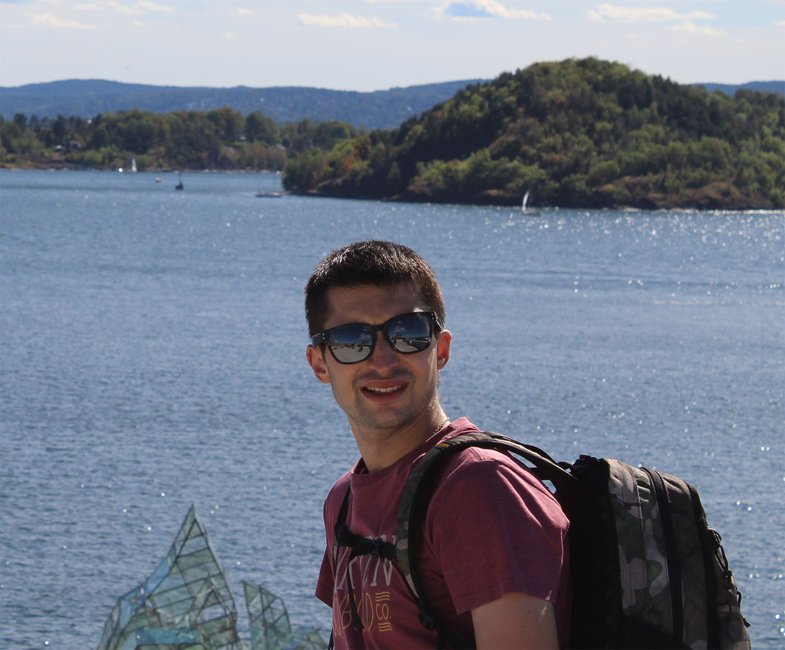

# Junior Developer Resume

1. Dmitrii Erkin
2. Phone number: *+7 (937) 170 77 04*, email: *tomountain@mail.ru*
3. In my free time I learn the basics of html, css, javascript. I create pages on psd templates that are in the public domain. I solve tasks in codewars [codewars](https://www.codewars.com/users/DmitriEr?refreshed=true) and I study the online tutorial learn.javascript. I combine everything with learning English. My goal is constant development, obtaining new knowledge and putting them into practice.
4. My skills: I have expirience in html, css (plus SASS), javascript, the BEM methodology. Work with photoshop.
5. Example code: 
~~~javascript
function accum(s) {
  return s.split("").map((a, index) => a.toUpperCase() + a.repeat(index).toLowerCase()).join("-");
}
accum("ZpglnRxqenU");
//A-Bb-Ccc-Dddd
~~~
6. Link [GitHub](https://github.com/DmitriEr?tab=repositories) to my repositories in GitHub.
7. Link to my profile in HTMLacademy [htmlacademy](https://htmlacademy.ru/profile/id1043565).
8. My English is *intermidiate*.